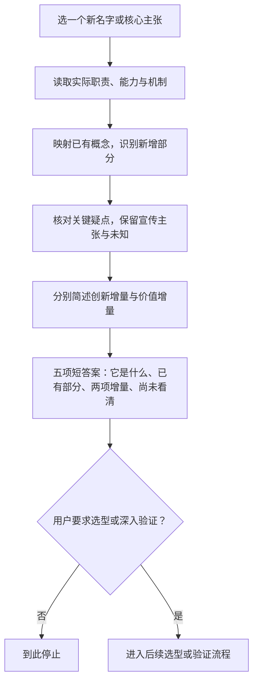

# 扒马褂（ba-ma-gua）

一个帮助 AI Agent 快速拆解新名字、映射已有概念，并分别简述创新增量与价值增量的 Skill。

<p align="center">
  
  <br />
  <sub><em>Ba ma gua</em>（扒马褂）借用了一个直白的视觉隐喻：脱掉新名字的外衣，看清里面的机制、已有部分和新增部分。</sub>
</p>

## 问题 / 麻烦

AI 时代的新名字和宣传叙事很多，用户需要快速看懂它实际是什么：

- 名称和口号遮住了实际职责、能力与机制。
- 看到组件已有，就仓促断言“毫无创新”。
- 把“有没有新意”和“有没有价值”混成一个判断。
- 把演示、愿景和作者自述当成已验证的能力。

扒马褂先帮助理解对象。采购、选型、系统替换和完整方案比较按后续请求展开。

## 根因

- **名称代替机制：** 仅凭名字归类，容易映射到错误的已有概念。
- **增量维度混淆：** 已有能力的整合可以有价值，新机制也可能在某个价值维度上没有优势。
- **证据边界缺失：** 宣传主张和未说明部分被悄悄补成事实。
- **分析没有终点：** 过度拆解或深入选型拖慢了快速理解。

## 对策

1. 选一个新名字或核心主张，找出实际职责、能力、机制和组件。
2. 根据机制映射到熟悉的已有概念；机制未说明时保留未知。
3. 区分已有部分、新机制、新组合方式和整合带来的能力。
4. 核对影响当前解释的关键疑点，区分版本、口径差异与材料冲突。
5. 分别简述创新增量与价值增量，达到停止条件后给出短答案。

核心原则：已有组件可以组合出新能力；价值增量高可以同时伴随创新增量低。证据不足时保留未知。

## 判断路径



## 输出与停止条件

默认简要回答五件事：

1. **它是什么：** 用一句熟悉的话解释新名字。
2. **已有部分：** 对应哪些已有概念、组件或机制。
3. **创新增量：** 新机制或组合方式是什么；未看清则明确说明。
4. **价值增量：** 多了什么能力或便利；注明尚未验证的宣传主张。
5. **尚未看清：** 缺少哪些说明，有哪些未解决冲突。

能解释关键差异就停。只有仍有关键不明之处时，才继续拆解。输出区分“已看清”“声称新增”“尚未看清”；理解材料的说法，不等于验证材料的说法。

流程不强制寻找最强替代、双基线或完整选型矩阵。需要比较采购、成本和替换方案时，再按后续请求深入。

## 安装

```bash
git clone https://github.com/zhaidewei/ba-ma-gua.git
cd ba-ma-gua
./scripts/install.sh both
```

将 `both` 换成 `codex` 或 `claude` 可以只安装到一个工具。脚本不会覆盖既有安装。

### 在 Codex 中通过 Skill Installer 安装

```text
使用 $skill-installer 从 zhaidewei/ba-ma-gua 的 skills/ba-ma-gua 安装
```

## 使用

安装后可以直接说“扒马褂”或“帮我扒一下马褂”，附上链接、项目名或待理解的主张：

```text
扒马褂 https://github.com/QingYunA/answer-me-with-html
```

也可以显式调用技能。单纯询问“扒马褂是什么意思”直接简要解释，不启动完整流程。

Codex：

```text
用 $ba-ma-gua 解释这个 Data Agent 实际是什么，映射到熟悉概念，分别说清创新增量、价值增量和尚未看清的部分。
```

Claude Code：

```text
/ba-ma-gua 看清这个新名字的机制、已有部分、新增部分和未知。
```

完整规则见 [`skills/ba-ma-gua/SKILL.md`](skills/ba-ma-gua/SKILL.md)。

## License

[MIT](LICENSE)
