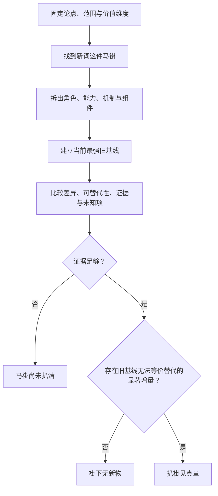

# 扒马褂（ba-ma-gua）

一个帮助 AI Agent 拆解新词、新概念和营销叙事，识别旧身、真实增量与独特价值的 Skill。

<p align="center">
  
  <br />
  <sub><em>Ba ma gua</em>（扒马褂）借用了一个直白的视觉隐喻：先脱掉新概念华丽的外衣，再看里面是熟悉的旧零件，还是确有一颗新心脏。</sub>
</p>

## 问题 / 麻烦

新词很容易把熟悉的组件包装成新范式：

- 发布会给组合方案起了新名字，讨论便从机制滑向口号。
- 看到组件都已存在，就仓促断言“毫无创新”。
- 比较对象选得太弱，让普通集成看起来像巨大突破。
- 证据不足时，人和 Agent 会替厂商补齐尚未证明的价值。

结果是两种同样草率的判断：被新词带着兴奋，或因为“以前都有”而错过真正的组合创新。

## 根因

- **外衣与机制混在一起：** 名称、定位和价值主张遮住了实际角色、能力与组件。
- **缺少最强旧基线：** 新对象常被拿去和过时方案比较。
- **差异没有经过替代检验：** 功能不同未必带来不可替代的价值。
- **未知项被悄悄补全：** 路线图、演示和愿景被当成已经发生的事实。

## 对策

`ba-ma-gua` 把祛魅变成一套有明确步骤的比较过程：

1. 固定要判断的论点、范围和价值维度。
2. 找到新词这件“马褂”，再把角色、能力、机制和组件拆出来。
3. 认出旧身，建立当前最强、现实可用的旧基线。
4. 比较差异、可替代性、证据和未知项。
5. 检验组合是否产生新能力、数量级提升或 `1 + 1 > 2`。

核心原则：组件已有，不能直接否定组合创新；证据不足，也不能替新概念补逻辑。

## 判断路径



## 安装

```bash
git clone https://github.com/zhaidewei/ba-ma-gua.git
cd ba-ma-gua
./scripts/install.sh both
```

将 `both` 换成 `codex` 或 `claude` 可以只安装到一个工具。脚本不会覆盖既有安装。

### 在 Codex 中通过 Skill Installer 安装

```text
使用 $skill-installer 从 zhaidewei/ba-ma-gua 的 skills/ba-ma-gua 安装
```

## 使用

安装后可以直接说“扒马褂”或“帮我扒一下马褂”，附上链接、项目名或待核查的主张：

```text
扒马褂 https://github.com/QingYunA/answer-me-with-html
```

也可以显式调用技能。单纯询问“扒马褂是什么意思”属于事实查询，不启动评估流程。

Codex：

```text
用 $ba-ma-gua 拆解“Data Agent 是数据工程的新范式”这个说法。
```

Claude Code：

```text
/ba-ma-gua 看看这个新概念是旧东西换名，还是确有真实增量。
```

完整规则见 [`skills/ba-ma-gua/SKILL.md`](skills/ba-ma-gua/SKILL.md)。

## License

[MIT](LICENSE)
