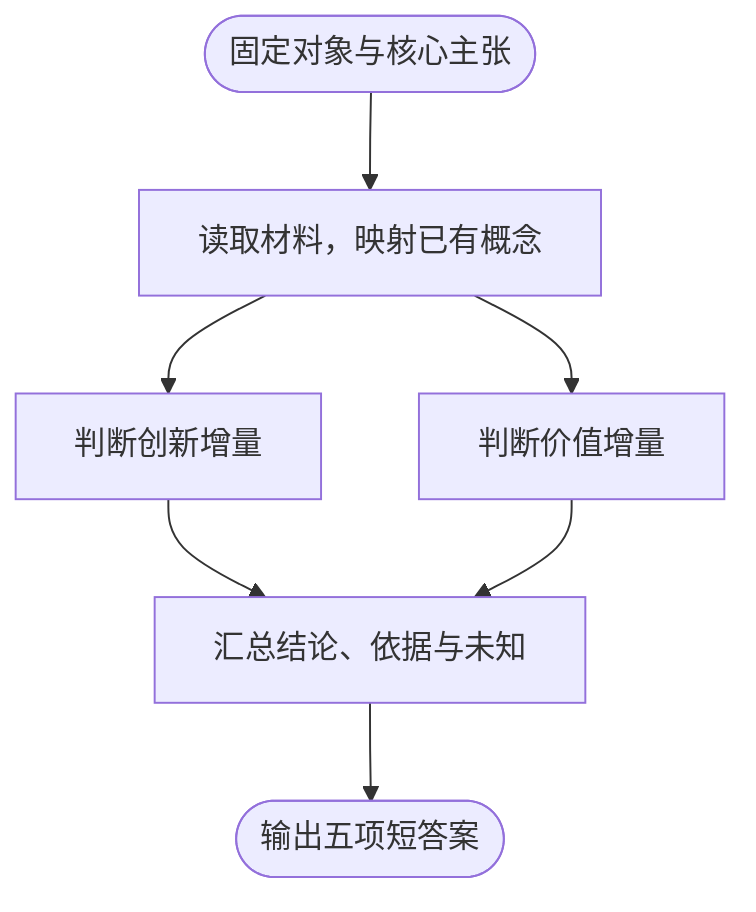
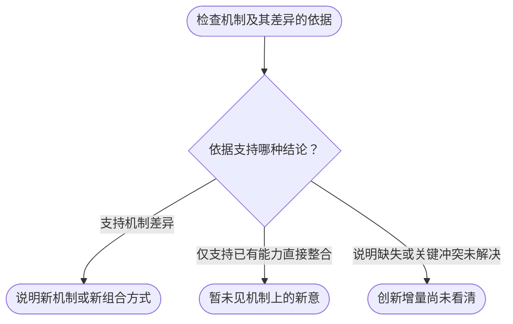
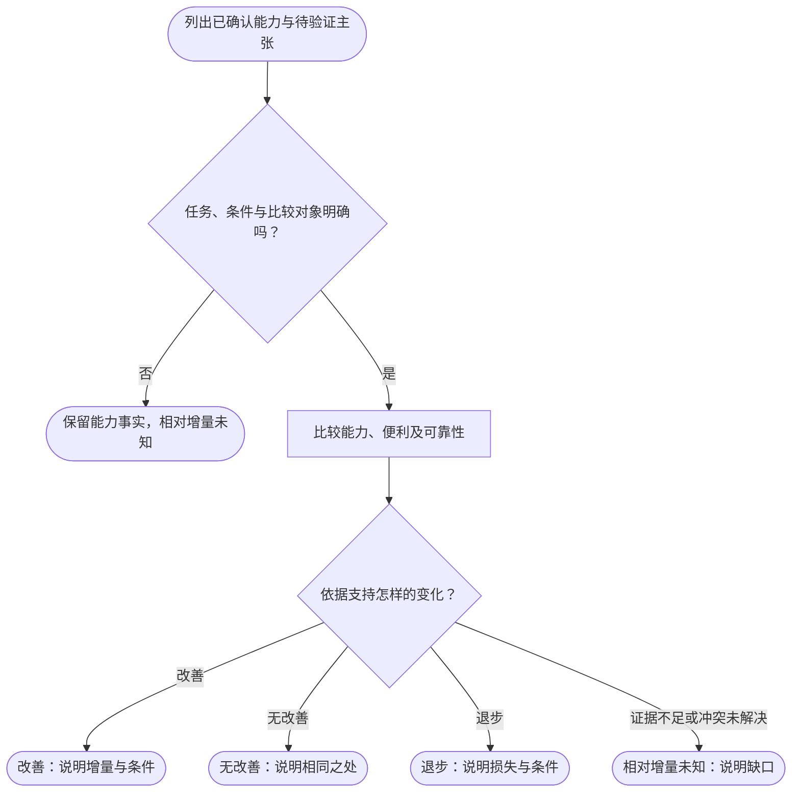

# 扒马褂决策树

创新与价值分别判断。关键结论附来源，注明作者说明、代码、实测或分析推断。

## 主流程

五项短答案：它是什么、已有部分、创新增量、价值增量、尚未看清。
只核对影响结论的冲突。缺少说明时保留未知。
用户要求选型或深入验证时，再展开后续任务。

## 创新增量

按核心主张判断。包含多个独立机制时，分别说明结论。
已有组件可以组成新机制。组件已有，不能直接推出没有创新。
作者的创新主张须注明尚未验证。

## 价值增量

整合产品还要简查可用的 X+A+B 组合，识别整合本身的增量。
按维度分别判断。能力可以改善，同时便利或可靠性退步。

有可比数据就报告数据，否则说明有依据的定性变化。
完整成本测量和选型按后续请求展开。

创新与价值分别判断。任何一项结论都不能代替另一项。

完整执行规则见 [SKILL.md](../SKILL.md)。
